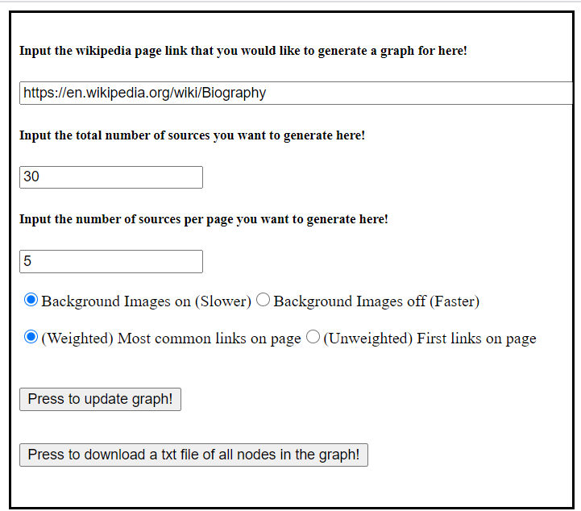

# Wikipedia Article Network
 
## Introduction (Problem Description and Project Question)

Ever since the dawn of the internet age, Wikipedia is a name familiar to almost all internet users. First going online way back in January 10 of 2001, Wikipedia can be referred to as one of the world's most accessible and extensive encyclopedias (Wikipedia: About). However, different from common databases, it is written mostly by volunteers on the internet, meaning that anyone is capable of editing and using its contents. Although it is not the best place for accurate research means, the massive contribution gives it millions of articles from broad topics to minuscule details that are constantly referenced throughout its pages. On one page of Wikipedia, one can usually find various blue texts that are hyperlinks to other Wikipedia pages that explain the context of that blue text. This provides users the freedom to navigate and associate keywords related to such topics, thus possibly providing more ideas to aid the user’s desired research.

Our motivation for this project is to utilize the expansiveness and connectivity of Wikipedia to explore the association between wiki topics in the form of a graph-like output. By focusing only on the keywords and maybe one or two descriptive sentences, it rids the unnecessary errors that comes with crown contribution to Wiki articles. Although it might seem like a waste of time to only focus on the Wiki topics, we have discovered it to actually be an efficient means of brainstorming when one wishes to research into a topic. Taking the topic "Computer Science" for example, if one were to research into such matter for the first time, it might be confusing if they were to read a ten paged essay on the history of computer science and such. However, if we were to prompt them with a graph with keywords such as "Computer", "computer engineering", "theory of computation", and "Algorithm", which we have gotten from the lengthy and detailed paragraph from Wikipedia, it might immediately provide them a grasp of what this topic is. Our goal for this project, is thus to create and visualize an algorithm able to quickly conceptualize the association between Wikipedia articles and then display it in the form of a graph.

Therefore, in order to fulfill our motivation and goal, our main question which we will constantly remind ourselves throughout this project is: 

**How can we use graphs to visualize the connections between related Wikipedia articles to aid the research and comprehension process?**

## Instructions for Running the Program

### Libraries to be installed:

* dash
* dash-cytoscape
* html and urllib are already part of the Standard Library that comes with Python 3.9. Thus, it is not required to install it. However, if necessary, please install these libraries as well.

## Other necessary instructions:

* After running the final output link with **Background Images on**, it is possible for the images to fail to display. When that occurs, use Google Chrome instead of Safari.
* When running [main.py](https://github.com/faizahsayyid/wikipedia-article-network/blob/main/main.py), do not attempt to run two separate instances of the file at once in pycharm. This causes the port to be jammed which returns `OSError: [Errno 48] Address already in use error`. This can be solved by changing the port number a few digits up or down in `app.run_server(debug=True, port=3004)` under `if __name__ == '__main__':`.
* If the text file does not download when using the "Press to download a txt file ..." button, check that your browser is not blocking the download. In chrome this should appear on the right side of the url bar.

### The output Wikipedia graph:

* After installing the libraries specified and running the [main.py](https://github.com/faizahsayyid/wikipedia-article-network/blob/main/main.py) file in the console, a link will appear in the console which looks like this: `Dash is running on http://127.0.0.1:3004/` To see the output, simply click on this link, and a webpage with the graph will open up.
* Our Wikipedia graph is displayed using an interactive Dash app that allows the user several different functionalities.
* First, the app allows the user to input the link to the wikipedia article they want to generate a graph of, as well as the number of total sources they'd like to generate for that graph and the number of sources per wikipedia article to generate as well.
* Alongside this main functionality, we also have two additional features that the user can select. The first of these options determines whether the graph is generated with the background of each node being the article's image, or if the nodes are generated with flat background colors. Generating the graph with images is significantly slower but adds visual interest to the graph, so we made it optional. The second option is whether to use our weighted wikigraph or our unweighted wikigraph. The weighted version counts the number of times a link appears on a page, and returns the links that appear the most on the page. The unweighted version just returns the first links on the page. As a result, the weighted version is a bit slower but returns better results than the unweighted version. We added both options so that the user can compare between the two versions. An image of this input areas is displayed below:

* Once the user has inputted their preferred options, they can then click the "press to update graph" button which will update the graph. Please note that large graphs may take some time to load, but as long as the spinning loading icon (which appears after pressing the button) is there, the graph is still processing. If you zoom out and lose the graph, simply regenerate the graph or reload the page. An image of the an example graph with images turned on is displayed below:

* The final piece of functionality is a download text file button. This button downloads a generated text file of all the nodes in the graph, with each node's link, title, and summary listed out in the file. Please note that the loading icon indicates the file is still generating, so once it disappears the file should be downloaded. If the file does not appear to download, check that your browser is not blocking the file from downloading. An image of what this loading icon looks like is attached below:

## Computational Plan

### Data Representation and Graphs as Central Role:

* Although we have not used datasets in our project, there exist a data that defines our chosen domain – HTML data of Wikipedia Articles.
* There are two graph data types we have created: `Wikigraph` and `WeightedWikigraph`
* `Wikigraph`: Each vertex in the graph represents a Wikipedia page, and an edge exist between two vertices v1 and v2 if and only if v1 contains a link to v2 or v2 contains a link to v1. Each vertex has 4 attributes: 'name' and 'url', both strings which stores the title of the Wikipedia article and the url of the Wikipedia webpage respectively. Next we have 'class_id' and 'neighbours', the first referring to the ASCII representation of 'name' and the latter referring to a set of vertices that are adjacent to the current vertex.
* `WeightedWikigraph`: A weighted vertex is similar to the vertex in Wikigraph with just one difference. The 'neighbours' attribute in the WeightedWikigraph is a dictionary, where each key value pair is a vertex and its weight. Each edge {v1, v2} contains a weight based on the average between the number of times v1.name appears in the html code of v2 and the number of times v2.name appears in the html code of v1.

### Major Computation – Parsing Wikipedia Information:

* The main functions involved in parsing the data we need from a Wikipedia article are:`get_adjacent_urls`, `get_adjacent_urls_weighted`, and `get_summary`. We also created `WikipediaArticleParser` and `WikipediaSummaryParser` which are subclasses of `HTMLParser` from `html.parser`, to help these functions parse our desired data. These functions and class can be found in our [wikipedia_html_parser.py](https://github.com/faizahsayyid/wikipedia-article-network/blob/main/wikipedia_html_parsers.py) module.
* `WikipediaArticleParser`: This class inherits the method `feed` from the `HTMLParser` abstract super class which uses other methods such `handle_starttag`, `handle_endtag` and `handle_data` to parse our desired information from the given html code. Our subclass `WikipediaArticleParser` is used to Wikipedia article hyperlinks from the html code of another Wikipedia article. To do this we only needed to implement `handle_starttag` such that when it find an `<a>` tag with the `href` attribute mapped to a Wikipedia article link, it adds it to the instance attribute `WikipediaArticleParser.articles`
* _Note:_ Our `WikipediaArticleParser` does not collect certain Wikipedia links, such as links that contain 'Help:', 'Category:', 'Book:', or '(disambiguation)' since we find that these article lead to topics that are completely unrelated to the original article. For instance, a link that contains '(disambiguation)' leads to pages that are used to help disambiguate which article a Wikipedia user actually wants based on what they are searching for. Let's say a Wikipedia user searches for 'Animal', then the animal disambiguation page will show you articles about actual animals, albums with the title 'Animal', and some one who has the nickname 'The Animal', to help decipher which of these the user wanted. But these are completely unrelated topics! Furthermore, for our purposes collecting the Wikipedia help page will not be useful. We used the constant `UNWANTED` to filter out these unwanted Wikipedia pages
* `get_adjacent_urls`: This function is for extracting the adjacent Wikipedia articles for a given url. We use urllib to open the given Wikipedia article link and then extract the html code. After we feed the html code to our `WikipediaArticleParser` to collect the articles that are adjacent to the given Wikipedia article.
* `get_adjacent_urls_weighted`: Similar to `get_adjacent_urls` except we are also collecting the weights. We are only collecting one side of the weight in this function (the number of times the name of the adjacent article appears on the input url articles, but not vice versa). We do this by using `str.count` on the html code to search for the number of occurrences of the adjacent article names.
* `WikipediaSummaryParser`: Similar to the `WikipediaArticleParser`, this class also utilizes `feed` from the `HTMLParser` abstract super class which uses `handle_starttag`, `handle_endtag`,  `handle_data` to parse desired information from the html code. Different from `WikipediaArticleParser`, instead of fishing for hyperlinks, our subclass `WikipediaSummaryParser` is used to extract a brief summary of the wikipedia article. This changes the implementation of `handle_starttag` as it now uses a private instance attribute `_found_p` to tell us when we are in a paragraph tag.
* `get_summary`: This function extracts `<sentences_wanted>` number of sentences from the Wikipedia article as the summary of the topic, defaulted to two sentences. We use `urllib` to open the given Wikipedia article link and extract the html code. We feed our code to the `WikipediaSummaryParser` to collect the summaries in the Wikipedia article.

### Major Computation – Building Wiki Graph (Unweighted & Weighted):

* The functions involved in building both `Wikigraph` and `WeightedWikigraph` exist in the [build_wikigraph.py](https://github.com/faizahsayyid/wikipedia-article-network/blob/main/build_wikigraph.py) module
* `build_wikigraph`: this function uses a breadth-first-search algorithm to build a `Wikigraph` for a given link to a Wikipedia article, a desired number of additional sources (`num_sources`), and a desired number of `sources_per_page`. We decided to limit both the number of additional sources and sources per page we collect since Wikipedia has a huge network of articles that connect to each other, and we wanted to show possible connections between articles that are not just directly on the input Wikipedia article. We used a queue to keep track of which vertex/article we are currently extracting links from. We used a list called `visited` to keep track of vertices/articles we have already added to the graph. Essentially, starting with initial given link to a Wikipedia article, we find at most `sources_per_page` from that article using `get_adjacent_urls`, add those articles as vertices in our graph, and add edges between the those articles and the current url we are parsing. We also add these articles to our queue, so that we can then repeat the process for those articles (as long we haven't surpassed our limit of `num_sources`).
* `build_weighted_wikigraph`: this functions uses the same algorithm as `build_wikigraph` except we use `get_adjacent_urls_weighted` to find the neighbouring articles as well as there weights. Since our weights are based on the average between the number of times the name of one article appears on the other and the number of times the other article name appears on the first article, we decided to keep track of the weights using a dictionary `edges_to_weights` in order to collect each part of the weight separately so we didn't have to parse through the same article twice. Then we calculated the weights of each edge once we found our desired number of sources.

### Program Output – Displaying an Interactive Graph:

* Our program output uses Dash-Cytoscape (Described in more detail below) to draw the graph. Dash takes the user input from all of the text fields/options and uses these selections to generate a graph when the user presses a button. It then transforms this graph in to a list(dict) format cytoscape understands, and adds styling to each node to make the graph more legible. Finally, it displays the graph for the user to see.

### Libraries – HTML Parser and Urllib:

* There are several different parsers in this section (all can be in [wikipedia_html_parsers.py](https://github.com/faizahsayyid/wikipedia-article-network/blob/main/wikipedia_html_parsers.py) module):
  * Article Parser: Used to parse the adjacent articles in order to build our graph.
  * Summary Parser: Used to parse the summary of an article for our graph visualization and research summary text file output.
  * Image Parser: This parser takes a given url and searches the page to find the article's image.  It is used by the `get_image` function to return the article's image.
  * We used `urllib` to open the urls and extract there html code 

### Libraries – Dash and Dash-Cytoscape:

* The Dash library is a library used for building interactive web applications using python. Dash-Cytoscape is an extension of this library used to display graphs in dash. Dash-Cytoscape has two main lists it uses to displays nodes and edges, the first list being the elements of each node/edge and the second being a stylesheet for the nodes. The elements of the list are dictionaries, where each dictionary stores the node's id, label, and class id (for CSS node styling). The stylesheet is also a list of dictionaries, with each dictionary containing a class id to add styling to and the styling to add to that class.
* Our `update_cytoscape_display` function pulls user input and builds it in to a cytoscape graph. In order to do this, since Dash-Cytoscape requires the data it displays to be in a specific dictionary in list format, we added a `to_cytoscape` function within the wikigraph class that transforms the graph's nodes and edges in to this format. It iterates over every node in the graph and adds each node as a dictionary, where the node's data includes it's url and name. There is also a "classes" index included in the dictionary which references the `class_id` of that vertex. Finally, after adding a node, it then adds a dictionary for the edges between that node and it's neighbours, where the source is the current node and the target is the neighbour. 
* A note on the `class_id`: This id is used for styling, since we needed a way to uniquely reference nodes while not referencing the ids of the edges between those nodes, as using the title of the nodes also references the edges. Using the url for this id was also problematic due to the special characters in the url. As a result, we are instead using an ascii numeric representation of the node's title for this id.
* Once this graph is generated, the `update_cytoscape_display` function will also go through each element in the newly generated graph and add a dictionary to the graph's stylesheet in order to add custom sizing (and background images, if selected) to each node in order to make the graph more legible and visually pleasing. This dictionary references the `class_id` of the node to apply styling to that node. This also uses the image parser to get article images.
* The last piece of functionality in dash cytoscape is the ability to generate a txt file for the graph. For this section, we use the Dash-cytoscape download component, which takes a string (built by [make_txt_file.py](https://github.com/faizahsayyid/wikipedia-article-network/blob/main/make_txt_file.py) functions) and filename and downloads a file with those contents. This file is generated when the graph updates, but is only downloaded when the user presses a button.

## Discussion

Our final result was able to aid us significantly in answering the question we have proposed: **How can we use graphs to visualize the connections between related Wikipedia articles to aid the research and comprehension process?**

As expected, just the visualization of the graph was able to bring a lot of clarity to otherwise tedious process of reading over the wiki article. One thing we have discovered is the cycles in the graph represent the interconnectedness of the articles in that the cycle. For instance 'Computer Graphics', 'Pixels', and 'Graphics' may exist in a cycle since they are topics that are dependent on each other. Other aspects of our output such as the research summary and the url also gave us guide in comprehending  the topics. Although one might be capable of grasping rough ideas through the visualized graph, we realized having a summary as well as an url aids the research and comprehension significantly as it gave the user enough of a description to proceed further in their research. Our new Graph class – the weighted graph – allows the user to continue their research on a topic with certainty that the keywords provided by the weighted graph are related and important to the topic.

Throughout the construction of the project there were various limitations we must overcome. First, the Wikipedia articles itself poses challenges. It is well known that Wikipedia being open to edit results in the possible inaccuracy of its information. Also, the Wikipedia topics which we have collected are not keywords that hold direct association to the subject matter, but rather words that Wikipedia has an article of. Thus, the limitations of building a graph using keywords from Wikipedia articles is the possibility for a graph to have unnecessary or faulty associated topics. This might hinder the user's learning and researching experience as the incorrect output might distort the user's understanding of the topic.

Although thanks to the kind suggestion from the TA during the project proposal phase, we were able to implement Breadth First Search instead of recursion which rid us the trouble with the stack overflow error. The BFS does not account for the running time complications that exist with using html instead of a dataset. The issue is more obvious in weighted graphs as it was necessary for us to completely alter the way we retrieve the occurrences of the topic url from html in order to avoid an extremely long running time.

Looking back at the project, what we could have done differently is use a different algorithm in the calculation of the weighted graph. The algorithm used this time is assigning weights based on average of the number of occurrences the Wikipedia topic url has in the html file in each of the two vertices. However, this weighting only accounts strictly the repetition of hyperlinked topics but not the length of the wikipedia article. Thus, the prioritized topics might sometimes be ones from lengthy and irrelevant wikipedia articles rather than from the short and concise ones. One suggestion might be to normalize the weight by dividing by the number of words in the article.

Putting the limitations aside, the next step for this project will not only be confined within the boundaries of Wikipedia. Instead of using wiki articles, further exploration of this project might lead us to the realm of actual research papers. We could utilize the reference list of the research papers to give the user a graph of research topics and articles expanding off the original paper. This will not only act as a guide for researchers to understand the scope of such papers, but also provide them with an extensive amount of topics. This rids the trouble of searching for appropriate readings and instead could give a visualization of all the different possible pathways the user can explore from just one paper.

Concluding from what we have discussed so far, our answer to the question at last would be: **By visualizing the connections between related Wikipedia articles in the form of an interactive graph, it allows the user to grasp a brief idea of the subject matter while also allowing them to research it further, thus benefiting both the research and comprehension process.** This permits the user the freedom to explore each subtopic of their research question easily without having to go through the lengthy and time consuming Wikipedia articles.
